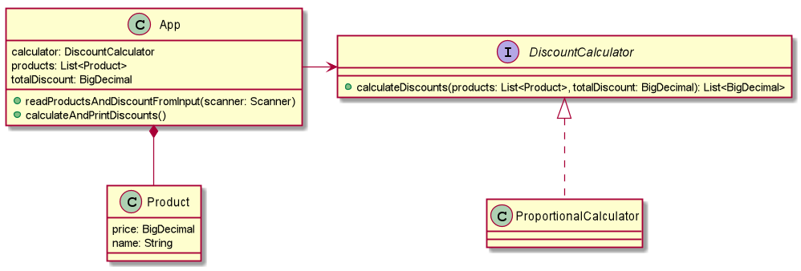

# unity-recrutiment
Zadanie rekrutacyjne do firmy UnityGroup

### Dodatkowe założenia

Oto założenia, które przyjąłem, a nie wynikają bezpośrednio z treści:
- ceny i rabaty są reprezentowane jako liczby wymierne z maksymalnie dwoma miejscami po przecinku (reprezentacja złotych i groszy)
- "idealne proporcje" to takie, wg których rabat dla danego produktu jest liczbą zgodną z ustaloną wyżej reprezentacją rabatu (tj. z dokładnością do grosza)
- gdy proporcje nie są idealne, wyliczony rabat jest zaokrąglany w dół, a nadwyżki są dodawane do ostatniego produktu. 
  Powoduje to jednak problem, ponieważ ostatni produkt może mieć bardzo niską cenę i nie będzie można dodać całej nadwyżki
  ze wszystkich pozostałych produktów (rabat na pojedynczy produkt nie może przekraczać jego ceny). Wtedy naliczony na ostatni produkt rabat
  równy jest jego cenie, a suma rabatów nie jest równa całemu rabatowi. Próba rozłożenia nadwyżki z zaokrąglenia na inne produkty
  mogłaby być rozwiązaniem, ale byłaby sprzeczna z wymaganiami zadania.
  
### Diagram klas


### O projekcie
- W fazie projektowania zdecydowałem się na design podobny do wzorca Strategia, tak by w przyszłości
inne implementacje DiscountCalculator mogły być używane bez zmiany kodu (open/close principle).
- Postanowiłem użyć klasy BigDecimal do reprezentacji wszelkich wartości cenowych,
większy nacisk położyłem na bezpieczeństwo i dokładność obliczeń niż szybkość w tym przypadku.
- W mojej implementacji zaokrąglałem na korzyść sklepu, ale przed wypuszczeniem takiej aplikacji
wg mnie należałoby się jeszcze skonsultować z klientem (tzn. sklepem) i potwierdzić sposoby zaokrąglania
oraz skalę dokładności użytą w ProportionalCalculator.
- Dane są wprowadzane przez standardowe wejście i to w tym momencie są walidowane (max. 2 miejsca po przecinku,
max. 5 produktów)

### Sposób użycia
Do zbudowania programu potrzebny jest Maven (testowane na wersji 3.6.2).

Budowanie i kompilacja:
```
mvn install
```
Uruchomienie:
```
java -cp target/recruitment-1.0-SNAPSHOT.jar app.Main
```
